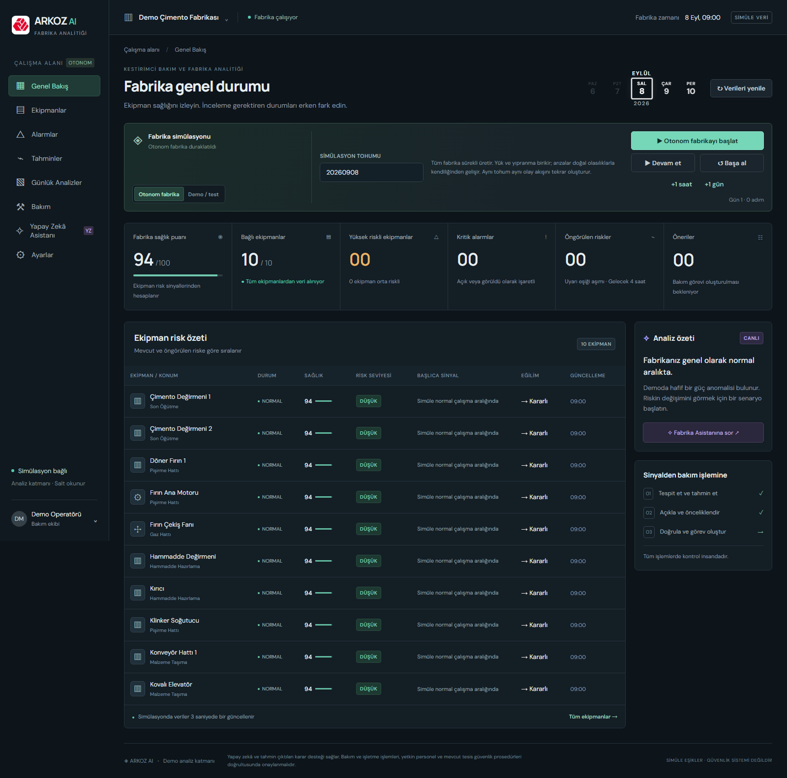
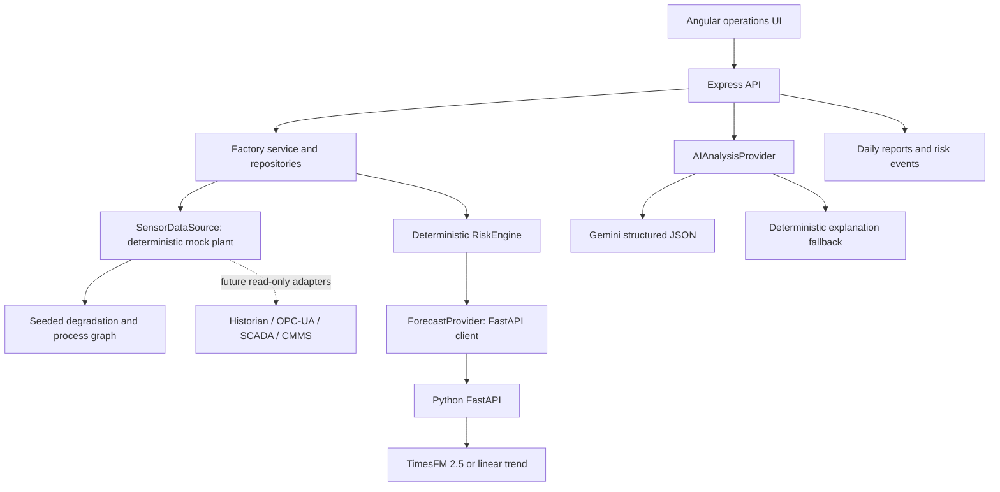

# ARKOZ AI

**Arayüz Türkçedir.** Menüler, ekipman adları, alarm nedenleri, bakım kayıtları ve yapay zekâ yanıtları Türkçeleştirilmiştir. Tarih ve sayılar Türkçe biçimde gösterilir. Docker kullanmadan `npm run dev` ile başlatıp **http://localhost:4200** adresini açabilirsiniz. Türkçe panel rehberi: [Kullanım kılavuzu](docs/kullanim.md).

**Predictive Maintenance & Factory Intelligence Copilot** — a working Angular, Express and FastAPI demo for a simulated cement plant.

Detect → forecast → explain → prioritize → recommend → create a maintenance action.



## Run locally

Requirements: **Node 24.15+** (or compatible Node 22.22.3+), npm, Python 3.12. No API key, model download or database required.

From this project directory:

```sh
npm ci
python -m venv .venv
```

Windows PowerShell:

```powershell
.\.venv\Scripts\python.exe -m pip install -r forecast-service/requirements.txt
Copy-Item .env.example .env
npm run dev
```

macOS / Linux:

```sh
.venv/bin/python -m pip install -r forecast-service/requirements.txt
cp .env.example .env
npm run dev
```

Open **http://localhost:4200**. The launcher starts Angular on 4200, Express on 3000, and FastAPI on 8000. Ctrl+C stops the launched services. Angular uses an `/api` proxy, keeping API keys entirely on the server. FastAPI's interactive contract is at http://localhost:8000/docs.

This Windows workspace originally had Node 20.18. The root development dependency installs a **project-local Node 24.15**, used by npm scripts. Prefer installing a supported global Node version on a fresh machine. If an old npm runtime skips Angular's native optional dependencies, repeat installation under the project runtime:

```powershell
.\node_modules\node\bin\node.exe 'C:\Program Files\nodejs\node_modules\npm\bin\npm-cli.js' install
```

The npm CLI path depends on your Node installation. No global runtime was changed by this project.

## Docker

With Docker Desktop / Engine running:

```sh
docker compose up --build
```

Open **http://localhost:8080**. Nginx serves the Angular production build and proxies to Express. FastAPI and Express stay on the Compose network. Stop with `docker compose down`.

Default images deliberately omit PyTorch and model weights for a small, reliable fallback installation. Setting `FORECAST_PROVIDER=timesfm` without installing optional dependencies reports a fallback rather than preventing startup. For a TimesFM container, install `requirements-timesfm.txt` in the forecast image and provision memory/network access for the checkpoint download.

## Autonomous factory walkthrough

1. Select **Otonom fabrika**, keep or change the integer seed, and start the run. All ten machines advance together with shared production load, machine wear and small natural variation.
2. Degradation events arise from the seeded simulator without manual fault injection. The seed varies both timing and eligible source machines. Correlated sensors change on the source machine, while smaller load effects can propagate through multiple stages of the cement-process dependency graph.
3. Every three real seconds adds 15 simulated minutes. Use **+1h** or **+1 day** to accelerate the run. The same seed reproduces the same event sequence.
4. Deterministic risk scanning runs on every update. At each simulated day boundary, TimesFM produces a summarized 24-hour outlook and Gemini writes a strict Turkish day-end assessment.
5. Open **Günlük Analizler** to review the plant summary, next-day outlook, ranked assets, recommendations and risk-transition timeline.
6. Create and complete a maintenance task. In autonomous mode, completion clears that asset's active degradation effect and reduces simulated wear; subsequent samples show the recovery.

Autonomous runs stop after 30 simulated days to bound local resource/API use. Starting a run resets sensor/report state but preserves the in-memory task and alert repositories until the backend restarts.

## Controlled presentation walkthrough

1. Choose **Demo / test**, select **Bearing degradation — Kiln Main Motor**, then start the test.
3. Every three real seconds adds 15 simulated minutes. Watch normal → warning → high risk. Pause for presentation; **+1h** advances four samples immediately.
4. After around 16 samples (four simulated hours), open **Kiln Main Motor**. Vibration is about 5.94 mm/s; correlated bearing temperature is rising. Exact displayed values come from the deterministic source.
5. Review historical and forecast charts, warning lines, current readings, model provenance, possible causes and recommended inspections.
6. Click **Create maintenance task**. On Maintenance, move the task to In progress or Completed.
7. Acknowledge an alert. It remains monitored; increasing severity reopens it. Returning to baseline resolves it.
8. Ask Factory Copilot **“Why did Kiln Main Motor become high risk?”**. It uses current risk signals, forecast peaks, 24-hour changes and maintenance records, with asset source links.
9. Select Normal operation to run a controlled healthy baseline. Return to Autonomous factory for self-developing events.

Controlled scenarios always start from the same clean history. Bearing degradation raises motor vibration and bearing temperature; overheating raises ID fan bearing temperature; vibration anomaly affects Crusher; power anomaly affects Cement Mill 2. They stop after 32 samples. Autonomous operation uses a selectable seed and a 30-day limit. Pausing freezes simulated time. All timestamps are synthetic, anchored at 2026-09-08 06:00 UTC and displayed in the browser's timezone.

## Architecture



Folder boundaries:

| Path | Responsibility |
| --- | --- |
| `frontend/src` | Angular standalone views, polling, responsive UI, SVG time-series chart |
| `backend/src/domain.ts` | Typed assets, measurements, risk, alert/task models and repository interfaces |
| `backend/src/data.ts` | Seeded factory data, sensor configuration and scenario evolution |
| `backend/src/autonomous.ts` | Seeded degradation schedules, load/wear state and process propagation |
| `backend/src/reports.ts` | Daily forecast summaries, Gemini narrative and risk-event history |
| `backend/src/forecast.ts` | Forecast interface, validated Python client, emergency local fallback |
| `backend/src/risk.ts` | Risk scoring and actual threshold-crossing detection |
| `backend/src/factory.ts` | Approved read services, caching, alert lifecycle and repositories |
| `backend/src/analysis.ts` | Gemini adapter, response schema and deterministic interpretation |
| `backend/src/copilot.ts` | Bounded server-side context selection and grounded Q&A |
| `forecast-service` | FastAPI contract, replaceable Python model providers and tests |

The copilot selects approved services for machine-specific questions, fleet priorities and fastest vibration trends. It sends **summaries**, not massive raw arrays, to Gemini. This is intentionally a bounded tool/service dispatcher, without a general autonomous agent framework. Off-topic questions are limited to available plant information. No AI-generated output invokes machine controls.

## Gemini configuration

Set these values in root `.env`, then restart `npm run dev`:

```dotenv
GEMINI_API_KEY=your_key_here
GEMINI_MODEL=gemini-3.6-flash
GEMINI_MIN_INTERVAL_MS=3100
GEMINI_MAX_RETRY_WAIT_MS=5000
FORECAST_PROVIDER=fallback
FORECAST_TIMEOUT_MS=30000
```

The integration uses Google's **`@google/genai`** SDK and the Interactions API with `response_format: { type: "text", mime_type: "application/json", schema }` and server-side Zod validation. Model name is configurable because model access and availability vary. Official references: [Google SDK](https://googleapis.github.io/js-genai/) and [structured outputs](https://ai.google.dev/gemini-api/docs/structured-output).

Gemini receives machine metadata, deterministic risk signals, TimesFM forecast summaries and maintenance history. The server validates every response with Zod: required fields, bounded text, enumerated urgency/confidence, priorities, no HTML, no safety certification and no certain-failure language. Calls share a queue, are paced for the configured free-tier quota and follow short provider retry windows on temporary 429 responses; longer quota waits return the rule-based fallback immediately. Invalid output, missing keys, API errors and timeouts also fall back. The UI identifies the actual provider and assessment timestamp. Causes remain hypotheses; risk is calculated independently of Gemini.

## Forecasts and TimesFM

`POST /forecast` requires 8–2048 finite values, matching timezone-aware timestamps with a strictly increasing regular interval, and a horizon of 1–96 samples. For 15-minute plant data, 4 / 16 / 48 / 96 samples mean 1 / 4 / 12 / 24 hours.

The Python **linear-trend** forecaster remains the zero-download default. It fits the last 16 samples, ignores very small oscillatory slopes and damps distant extrapolation. A validated TypeScript equivalent keeps the UI operational during Python outages; charts explicitly identify this API fallback. The deterministic risk scan also uses this lightweight trend calculation on every 15-minute update so the live simulator remains responsive.

Optional TimesFM 2.5 setup:

```powershell
.\.venv\Scripts\python.exe -m pip install -r forecast-service/requirements-timesfm.txt
```

Set `FORECAST_PROVIDER=timesfm` in `.env` and restart. On Linux/macOS use `.venv/bin/python`. The adapter loads `google/timesfm-2.5-200m-pytorch` using `TimesFM_2p5_200M_torch.from_pretrained`, compiles `ForecastConfig`, and calls `forecast`. The package is pinned to `timesfm[torch]==2.0.2`. Inference is serialized. Loading or inference errors use the fallback with an explicit reason. Initial download may be substantial and inference needs more RAM/CPU than the default demo. The point-forecast adapter does not expose uncalibrated quantiles as confidence.

When enabled, explicit chart forecasts, machine-specific AI assessments and daily 24-hour outlooks use TimesFM. Fleet series are sent through `/forecast/batch` and evaluated in one model call. The TypeScript client sends the most recent 1024 samples, matching the model context during long runs. TimesFM predicts sensor values; the deterministic layer derives simulated warning-threshold crossings and risk. It does not claim a guaranteed breakdown date or remaining useful life.

**Licensing:** Google’s repository states that source code and model weights through TimesFM 2.5 are Apache-2.0, while **TimesFM 3.0 pretrained weights currently use a separate non-commercial/non-production license**. This demo targets 2.5 and does not automatically upgrade to 3. Review the exact component/model licenses and Gemini service terms before deployment. See the [official license notice](https://github.com/google-research/timesfm#license-notice-for-pretrained-weights) and [2.5 model card](https://huggingface.co/google/timesfm-2.5-200m-pytorch). Verification date: 2026-09-08.

## Risk interpretation

All thresholds in `backend/src/data.ts` are **SIMULATED CONFIGURATION**, not certified manufacturer or industry safety limits. Risk policy lives in `backend/src/risk.ts`.

Risk combines the current value, four-hour forecast peak, recent rate of change, baseline deviation, threshold crossings and the number of corroborating abnormal sensors. Health begins at 94 and decreases deterministically with severity and additional abnormal sensors. Risk thresholds are upper limits for this demo; no unsupported negative-pressure safety inference is made. Forecast threshold crossings use actual forecast samples at 15-minute resolution; already-exceeded thresholds are shown separately.

## Tests

```sh
npm run build
npm test
npx playwright install chromium
# With npm run dev running in another terminal:
npm run test:e2e
```

Tests cover autonomous repeatability and seed variation, spontaneous degradation, sensor-visible wear, multi-stage process propagation, maintenance recovery/history, controlled scenarios, simulation bounds, multi-day risk progression, daily reports, debounced risk events, current-versus-future threshold semantics, strict Gemini validation, forecast input/batching/context limits and the complete browser workflow. Browser tests also inspect the mobile layout and write screenshots to `docs/screenshots`. They reset sensor/report conditions before/after running but leave demo maintenance tasks and acknowledged/resolved alert history in memory. Run against a dedicated demo instance.

With Gemini configured and the local stack running, `npm run test:gemini` tests real machine-assessment and copilot calls and requires both responses to report `provider: gemini`. For browser verification that also requires every daily report to use Gemini, run `$env:REQUIRE_GEMINI='1'; npm run test:e2e` in PowerShell. These tests use the configured Gemini API quota; ordinary `npm test` remains offline.

## Real data and PostgreSQL integration

Implement `SensorDataSource` with read-only historian/OPC-UA/SCADA adapters and inject it into `FactoryService`. Preserve asset/metric identifiers, engineering units and timestamps. Add quality flags, late/missing sample handling, regular resampling, machine-specific operating states and manufacturer-approved thresholds before applying risk inference to real data. Keep credentialed industrial connectors on the server/network integration tier.

Implement `Repository<Alert>` and `Repository<Task>` using PostgreSQL, then inject those implementations in place of `MemoryRepository`. A production schema should separate assets, sensor definitions/readings, model-versioned assessments, alert events, tasks and maintenance history, with transactions and audit trails. `DATABASE_URL` is reserved and **not used** by the demo. No PostgreSQL installation is needed.

## Known limitations and trust boundary

- **All equipment, sensor values, maintenance records and thresholds are simulated.** Charts show the most recent 24 hours of a seven-day history; forecasts can extend 1–24 hours.
- Autonomous fault timing is synthetic and seed-driven. It demonstrates detection workflow quality; it does not validate real-world failure probability or remaining useful life.
- This is an **intelligence layer**, not a PLC, SCADA, DCS, CMMS or condition-monitoring replacement. It is not a certified safety system or guaranteed failure predictor.
- No control commands, automatic shutdowns or AI-directed actuator actions exist.
- In-memory state is shared by all browser sessions and lost on backend restart. Scenario activation resets sensor history. Task completion records maintenance history and reduces wear/active degradation in autonomous mode; controlled test curves remain fixed until a new test starts.
- The demo has no authentication, authorization, durable audit log, tenancy, industrial protocol connector or production rate limiting. Run locally or in an isolated demonstration environment.
- The forecasting model is not validated on cement plant failure labels. Risk scores are demo heuristics, not calibrated failure probabilities. Model-generated explanations can still be incorrect after schema validation.
- Gemini live calls require a valid key; the deterministic path is fully operational without it. Optional TimesFM checkpoint execution requires installing/downloading its dependencies and weights.
- Google-hosted fonts are optional; standard local font fallbacks keep the UI functional offline.

**AI and forecast outputs are decision-support information. Maintenance and operational actions must be validated by qualified personnel and existing plant safety procedures.**
